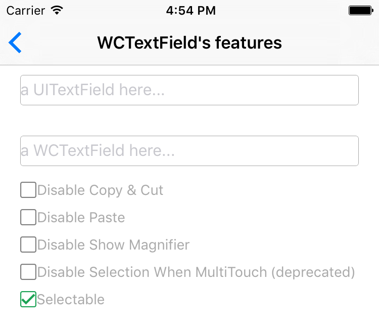

WCTextField
===================

[](https://travis-ci.org/wesley_chen/WCTextField)
[](http://cocoapods.org/pods/WCTextField)
[](http://cocoapods.org/pods/WCTextField)
[](http://cocoapods.org/pods/WCTextField)

WCTextField is a subclass of UITextField, fixing some issues and adding some features.

## Fix Issues

There are some issues with UITextField on iOS 7-9 as followings:   
1. When toggle `secureTextEntry` YES to NO and the cursor at trail, will show some unwanted spaces  


2. When `secureTextEntry` is NO, input some text, then toggle `secureTextEntry` to YES and back to NO, the text's font changed

3. When `secureTextEntry` is YES, the cursor in the middle of text, and toggle `secureTextEntry` to NO, the cursor's position is not correct

## Features
1. top and bottom separators

2. disable or allow showing Copy & Cut menu

3. disable or allow showing Paste menu

4. disable or allow showing Magnifier

5. disable or allow Selectable




## Requirements
1. ARC
2. iOS 7+

## Installation

WCTextField is available through [CocoaPods](http://cocoapods.org). To install
it, simply add the following line to your Podfile:

```ruby
pod "WCTextField"
```

## Author

wesley_chen, wesley4chen@gmail.com

## License

WCTextField is available under the MIT license. See the LICENSE file for more info.
